<p align="center">
  
</p>

# SuperSayan — WebMCP Security

A full-stack security research platform for Google Chrome's **WebMCP API**, built by [VRIL LABS](https://vril.li). It covers 15 novel 0-day CVEs disclosed on 2026-08-01, with live detection scanning, offensive simulation, and defensive hardening — all accessible at [webmcp.vril.dev](https://webmcp.vril.dev).<br /><br />

***The potentially novel CVEs detailed in this document were reported to Google on 8/04/2026.***

---

## What It Does

| Module | Description |
|--------|-------------|
| **Detection Engine** | Fingerprints the browser, analyzes WebMCP exposure, and scores threat level across all 15 CVEs |
| **Offensive Engine** | Simulates attack vectors — MSTI injection, DOM clobbering, GPU agent proxy, QUIC replay, tool poisoning, and more |
| **Defensive Shield** | Real-time countermeasures: MSTI shield, session guard, tool integrity verification, WebRTC/GPU protection |
| **OSINT Tracer** | Generates attribution reports and identifies datacenter ASNs |
| **Glow Extension** | Chrome extension (`chrome-extension/glow`) that surfaces MCP security status directly in the browser toolbar |

## CVE Coverage (15 Vectors)

`SW-MCP-PERSIST` · `GPU-AGENT-PROXY` · `DOM-CLOBBER-MCP` · `EXT-MCP-BRIDGE` · `ANNOTATION-CONFUSION` · `CSS-KEY-MCP` · `QUIC-MCP-REPLAY` · `AUDIO-MCP-FP` · `MCP-SUPPLY-CHAIN` · `ELICIT-PHISH` · `ABORT-RACE` · `DECL-FORM-HIJACK` · `CLIENT-INVERT` · `COMPOSE-XOR` · `OBSERVE-ORACLE`

Full disclosure: [`0-DAY-DISCLOSURE.md`](BUG-DISCLOSURE.md)

## Stack

- **Frontend:** Next.js 16 App Router, React 19, TypeScript, Tailwind CSS v4
- **Extension:** Chrome MV3 (`chrome-extension/glow`), TypeScript, esbuild
- **Infra:** Vercel (hosting + edge), Cloudflare (DNS/CDN)

## Getting Started

```bash
npm install
npm run dev        # http://localhost:3000
```

To build the Chrome extension:

```bash
cd chrome-extension/glow
npm install
npm run build      # outputs to dist/
```

Load `dist/` as an unpacked extension in Chrome (`chrome://extensions` → Developer mode → Load unpacked).

## Project Structure

```
src/
  app/              # Next.js App Router pages + API routes
  lib/supersayan/   # Core security library
    detection-engine.ts   # CVE scanning + threat scoring
    offensive-engine.ts   # Attack vector simulations
    defensive-shield.ts   # Real-time countermeasures
    osint-tracer.ts       # Attribution + ASN analysis
  components/       # UI components (shadcn/ui)
chrome-extension/
  glow/             # Chrome MV3 extension source
```

## License

See [`LICENSE`](LICENSE).

---

<p align="center">
  Built by <a href="https://vril.li">VRIL LABS</a> · Research disclosed 2026-08-01
</p>
